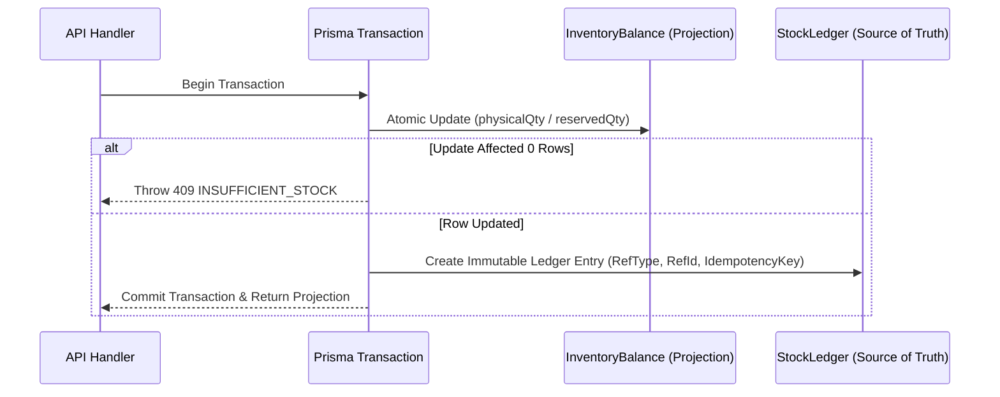
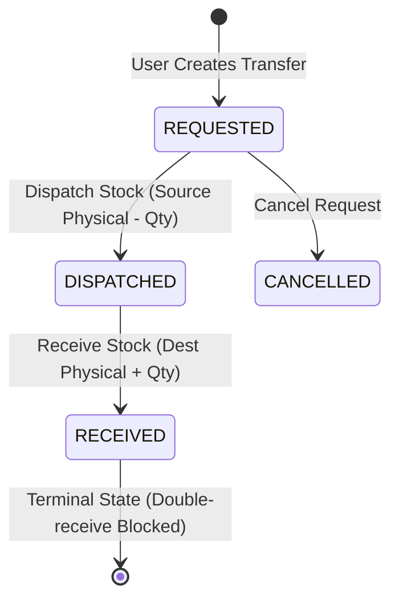

# 🧠 Algorithmic Decisions & Architectural Tradeoffs

This document outlines the core engineering decisions, concurrency algorithms, database trade-offs, and design rationale applied in the **Foundry Mini Operations ERP**.

---

## 1. Concurrency Control: Atomic SQL Conditional Update vs. Pessimistic Locking

### Decision
For stock reservations and transfers, we implemented **Atomic SQL Conditional Updates** inside Prisma database transactions (`$transaction`) rather than SELECT FOR UPDATE (Pessimistic Locking) or raw application-level checking.

### Algorithm Implementation
```sql
UPDATE "InventoryBalance"
SET "reservedQty" = "reservedQty" + $quantity,
    "updatedAt" = NOW()
WHERE "itemId" = $itemId
  AND "locationId" = $locationId
  AND "batch" = $batch
  AND ("physicalQty" - "reservedQty") >= $quantity;
```

### Rationale & Tradeoffs

| Aspect | Atomic Conditional Update (Chosen) | Pessimistic Locking (`SELECT FOR UPDATE`) | Application-Level Check |
|:---|:---|:---|:---|
| **Race Condition Risk** | **Zero** — Handled natively at PostgreSQL row-lock engine level | **Low** — Held lock until transaction commits | **High** — Vulnerable to Time-of-Check-to-Time-of-Use (TOCTOU) race conditions |
| **Deadlock Risk** | **None** — Single SQL statement execution | **Moderate** — Can deadlock if multiple rows locked out of order | **None** |
| **Throughput & Scalability** | **High** — Row lock held only for microseconds during single SQL update | **Low** — Blocked readers/writers for duration of entire app logic | **High** (but incorrect) |

---

## 2. Inventory Ledger Architecture: Immutable Append-Only Ledger vs. Mutable Balances

### Decision
We adopted a **Hybrid Double-Entry Projection Model**:
1. **`StockLedger` (Source of Truth)**: Immutable append-only ledger tracking every stock movement (`RECEIPT`, `MANUAL_ADJUSTMENT`, `DISPATCH`, `RECEIVE_TRANSFER`, `RESERVE`, `RELEASE`, `WORK_ORDER_FULFILL`).
2. **`InventoryBalance` (High-Performance Read Projection)**: Physical and reserved stock totals maintained for fast querying.

### Algorithm Flow


### Rationale & Tradeoffs
- **Auditability**: Every stock change leaves an immutable audit trail with author ID, timestamp, and idempotency key.
- **Read Performance**: Querying balances is $O(1)$ indexed lookup rather than aggregating $O(N)$ historical ledger entries on every request.

---

## 3. Work Order Shortage Calculation: Computed-on-Read vs. Persisted Columns

### Decision
Material shortage is **computed dynamically on read** (`shortage = Max(requiredQty - availableAtLocation, 0)`) rather than saved as a static column in `WorkOrder`.

### Rationale & Tradeoffs
- **Stale Data Prevention**: If stock is received or transferred by an Operations User, the shortage on a Work Order automatically drops **without needing background worker jobs or batch recalculations**.
- **Data Integrity**: Eliminates sync bugs between inventory balances and work order records.

---

## 4. Transfer Lifecycle State Machine

### Decision
Enforced a strict **linear state machine**: `REQUESTED → DISPATCHED → RECEIVED`.



### Core Business Invariants
1. **Source Stock Decrement on Dispatch**: Stock leaves the source location immediately upon dispatch.
2. **Destination Stock Protection**: Destination stock **MUST NOT** increase on dispatch; it increases **ONLY** when status moves to `RECEIVED`.
3. **Double-Receive Guard**: If a transfer is already `RECEIVED`, re-submitting `RECEIVED` is rejected with `TRANSFER_ALREADY_RECEIVED` (409 Conflict).

---

## 5. Idempotency Key Engine

### Decision
All state-mutating endpoints accept a unique `idempotencyKey` parameter backed by a `UNIQUE` index in the `StockLedger` table.

### Handling Logic
If a request is retried (e.g. due to network timeout), the database unique constraint catches the key and returns the existing transaction result without re-executing stock adjustments or writing duplicate ledger records.

---

## 6. Real-Time Streaming: Server-Sent Events (SSE) vs. WebSockets

### Decision
Implemented **Server-Sent Events (SSE)** via HTTP `/api/v1/events/sse` instead of WebSockets.

### Rationale & Tradeoffs
- **Simplicity**: SSE operates over standard HTTP/1.1 and HTTP/2 without requiring custom WebSocket handshake protocols or proxy upgrade configuration.
- **Auto-reconnection**: Browsers natively auto-reconnect SSE streams with `EventSource`.
- **Direction**: Inventory updates flow uni-directionally from server to clients, making SSE the ideal fit.
