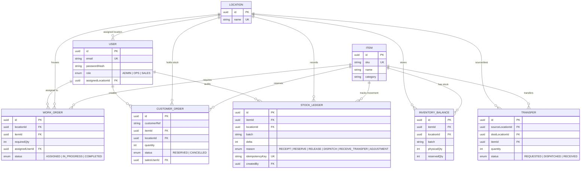

# FOUNDRY // FORGE-OS Entity Relationship Diagram (ERD)

```mermaid
erDiagram
    USER ||--o{ WORK_ORDER : "assigned to"
    USER ||--o{ CUSTOMER_ORDER : "creates"
    USER ||--o{ STOCK_LEDGER : "audits"
    LOCATION ||--o{ USER : "assigned location"
    LOCATION ||--o{ INVENTORY_BALANCE : "stores"
    LOCATION ||--o{ STOCK_LEDGER : "records"
    LOCATION ||--o{ WORK_ORDER : "houses"
    LOCATION ||--o{ TRANSFER : "source/dest"
    LOCATION ||--o{ CUSTOMER_ORDER : "holds stock"
    ITEM ||--o{ INVENTORY_BALANCE : "has stock"
    ITEM ||--o{ STOCK_LEDGER : "tracks movement"
    ITEM ||--o{ WORK_ORDER : "requires"
    ITEM ||--o{ TRANSFER : "transfers"
    ITEM ||--o{ CUSTOMER_ORDER : "reserves"

    USER {
        uuid id PK
        string email UK
        string passwordHash
        enum role "ADMIN | OPS | SALES"
        uuid assignedLocationId FK
    }

    LOCATION {
        uuid id PK
        string name UK
    }

    ITEM {
        uuid id PK
        string sku UK
        string name
        string category
    }

    INVENTORY_BALANCE {
        uuid id PK
        uuid itemId FK
        uuid locationId FK
        string batch
        int physicalQty
        int reservedQty
    }

    STOCK_LEDGER {
        uuid id PK
        uuid itemId FK
        uuid locationId FK
        string batch
        int delta
        enum reason "RECEIPT | RESERVE | RELEASE | DISPATCH | RECEIVE_TRANSFER | ADJUSTMENT"
        string idempotencyKey UK
        uuid createdBy FK
    }

    WORK_ORDER {
        uuid id PK
        uuid locationId FK
        uuid itemId FK
        int requiredQty
        uuid assignedUserId FK
        enum status "ASSIGNED | IN_PROGRESS | COMPLETED"
    }

    TRANSFER {
        uuid id PK
        uuid sourceLocationId FK
        uuid destLocationId FK
        uuid itemId FK
        int quantity
        enum status "REQUESTED | DISPATCHED | RECEIVED"
    }

    CUSTOMER_ORDER {
        uuid id PK
        string customerRef
        uuid itemId FK
        uuid locationId FK
        int quantity
        enum status "RESERVED | CANCELLED"
        uuid salesUserId FK
    }
```
